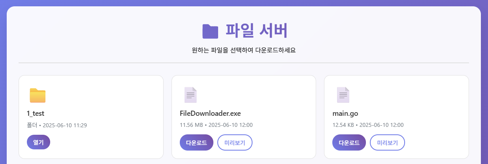

# 📁 Go 파일 서버

Go 언어로 작성된 간단하고 예쁜 웹 기반 파일 서버입니다. 로컬 폴더의 파일들을 웹 브라우저를 통해 탐색하고 다운로드할 수 있습니다.

## ✨ 주요 기능

- 🎨 **모던한 UI**: 반응형 디자인과 그라데이션 스타일
- 📂 **폴더 탐색**: 하위 폴더 이동 및 상위 폴더 돌아가기
- ⬇️ **파일 다운로드**: 원클릭 파일 다운로드
- 👀 **파일 미리보기**: 브라우저에서 바로 파일 내용 확인
- 📊 **파일 정보**: 파일 크기, 수정 날짜 표시
- 🔒 **보안**: 지정된 폴더 외부 접근 차단
- 🌐 **네트워크 접근**: 로컬 IP로 다른 기기에서도 접속 가능

## 🚀 설치 및 실행

### 필요 사항
- Go 1.16 이상

### 실행 방법

```bash
# 기본 실행 (8080 포트)
go run main.go <폴더경로>

# 포트 지정
go run main.go <폴더경로> <포트번호>
```

### 실행 예시

```bash
# 현재 폴더를 8080 포트로 서빙
go run main.go .

# Documents 폴더를 3000 포트로 서빙
go run main.go ./Documents 3000

# 절대 경로 사용
go run main.go /home/user/downloads 8080
```

## 📖 사용법

1. **서버 시작**: 위의 명령어로 서버를 실행합니다
2. **접속**: 웹 브라우저에서 표시된 주소로 접속합니다
   - 로컬 접속: `http://localhost:8080`
   - 네트워크 접속: `http://[로컬IP]:8080`
3. **파일 탐색**: 폴더를 클릭하여 이동하거나 상위 폴더 버튼으로 돌아갑니다
4. **파일 다운로드**: 다운로드 버튼을 클릭하여 파일을 저장합니다
5. **파일 미리보기**: 미리보기 버튼으로 브라우저에서 파일을 확인합니다

## 🖥️ 실행 화면

서버 실행 시 다음과 같은 정보가 표시됩니다:

```
🚀 파일 서버가 시작되었습니다!
📁 서빙 경로: /home/user/documents
🌐 접속 주소: http://192.168.1.100:8080
⏹️  종료하려면 Ctrl+C를 누르세요
```



## 🔧 기술 스택

- **언어**: Go
- **웹 프레임워크**: 표준 라이브러리 (`net/http`)
- **템플릿**: HTML Template
- **스타일**: CSS3 (그라데이션, 애니메이션)

## 🛡️ 보안 기능

- **경로 검증**: 지정된 폴더 외부로의 접근 차단
- **디렉토리 트래버설 방지**: `../` 등을 이용한 상위 폴더 접근 차단
- **안전한 파일 서빙**: 브라우저 보안 헤더 설정

## 🌐 네트워크 접근

다른 기기에서 접근하려면:

1. 방화벽에서 해당 포트 허용
2. 서버 실행 시 표시되는 로컬 IP 주소 사용
3. `http://[로컬IP]:[포트]` 형식으로 접속

## ⚠️ 주의사항

- 공개 네트워크에서 사용 시 보안에 주의하세요
- 중요한 시스템 폴더는 서빙하지 마세요
- 대용량 파일 다운로드 시 네트워크 상황을 고려하세요

## 🛠️ 커스터마이징

- CSS 스타일은 `htmlTemplate` 상수에서 수정 가능
- 파일 아이콘이나 색상 변경 가능
- 추가 기능 구현 시 핸들러 함수 추가
